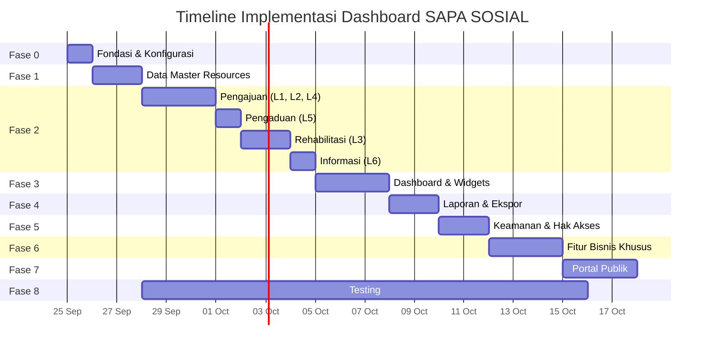

# 📋 Rencana Aksi — Dashboard Admin SAPA SOSIAL (Filament v5)

> **Stack**: Laravel 13 · Filament v5.8 · Livewire v4 · PostgreSQL
> **Basis**: [PRD_SAPA_SOSIAL.md](file:///c:/laragon/www/app-layanan/PRD_SAPA_SOSIAL.md)

---

## Status Proyek Saat Ini

| Komponen | Status |
|----------|--------|
| Models (30 file) | ✅ Selesai |
| Enums (9 file) | ✅ Selesai |
| Migrations (12 file) | ✅ Selesai |
| Factories & Seeders | ✅ Selesai |
| Admin Panel Provider | ✅ Selesai (SAPA SOSIAL) |
| **Filament Resources** | ✅ Selesai (Fase 1 & Fase 2) |
| **Filament Widgets** | ⏳ Fase 3 |
| **Filament Pages** | ⏳ Fase 4 |
| **Policies** | ⏳ Fase 5 |
| **Portal Publik** | ❌ Belum ada |

---

## Fase Implementasi

### Fase 0 — Fondasi & Konfigurasi *(1 hari)*

| # | Task | Detail | File/Lokasi |
|---|------|--------|-------------|
| 0.1 | Install paket pendukung | `spatie/laravel-permission`, `spatie/laravel-activitylog` | `composer.json` |
| 0.2 | Publish & jalankan migrasi Spatie | `php artisan vendor:publish --provider="Spatie\Permission\PermissionServiceProvider"`, dsb | `database/migrations/` |
| 0.3 | Setup roles & permissions seeder | Buat seeder roles: `administrator`, `petugas_dinsos`, `pejabat_penandatangan`, `pimpinan`, `operator_kecamatan_desa` | `database/seeders/RolePermissionSeeder.php` |
| 0.4 | Integrasi HasRoles pada User model | Tambah trait `HasRoles` di `User.php` | [User.php](file:///c:/laragon/www/app-layanan/app/Models/User.php) |
| 0.5 | Konfigurasi AdminPanelProvider | Atur navigation groups, branding, warna tema, dan `->discoverWidgets()` | [AdminPanelProvider.php](file:///c:/laragon/www/app-layanan/app/Providers/Filament/AdminPanelProvider.php) |
| 0.6 | Buat middleware/policy scope wilayah | Operator hanya lihat data wilayahnya, Pimpinan read-only | `app/Policies/` |

---

### Fase 1 — Data Master Resources *(Selesai)* ✅

Resources CRUD untuk data master yang dikelola admin. Semua resource memiliki navigation group **"Data Master"**.

| # | Resource | Model | Fitur Utama | Status |
|---|----------|-------|-------------|--------|
| 1.1 | `DistrictResource` | `District` | Table: code, name. Form: code (unique), name | ✅ Selesai |
| 1.2 | `VillageResource` | `Village` | Table: code, name, district. Form: district select, code, name. Filter: district | ✅ Selesai |
| 1.3 | `WorkUnitResource` | `WorkUnit` | Table: name, is_active toggle. Form: name, is_active | ✅ Selesai |
| 1.4 | `ServiceTypeResource` | `ServiceType` | Table: code, name, category, handler, is_active. RelationManager: `ServiceRequirements`. Form: code, name, category, handler select, needs_assessment, sla_days, is_active | ✅ Selesai |
| 1.5 | `DtsenPurposeResource` | `DtsenPurpose` | Table: code, name, max_decile, validity_days, is_active. Form: code, name, max_decile (1-10), validity_days, is_active | ✅ Selesai |
| 1.6 | `ClientCategoryResource` | `ClientCategory` | Simple resource: name | ✅ Selesai |
| 1.7 | `ComplaintCategoryResource` | `ComplaintCategory` | Table: name, is_active. Form: name, is_active | ✅ Selesai |
| 1.8 | `ReferralInstitutionResource` | `ReferralInstitution` | Table: name, type, is_active. Form: name, type select, address, contact, is_active | ✅ Selesai |
| 1.9 | `UserResource` | `User` | Table: name, email, work_unit, roles, is_active. Form: name, email, password, phone, nik, work_unit, district (operator), village (operator), is_active. Tab/action: assign roles | ✅ Selesai |

---

### Fase 2 — Resource Layanan Utama *(Selesai)* ✅

#### 2A — Pengajuan Layanan (Layanan 1, 2, 4)

| # | Task | Detail | Status |
|---|------|--------|--------|
| 2A.1 | `ServiceRequestResource` | Table: request_number, applicant_name, service_type, status (badge w/ color from enum), officer, submitted_at. Filters: status (SelectFilter), service_type, village, date range. Bulk action: assign officer | ✅ Selesai |
| 2A.2 | Form schema ServiceRequest | Sections: Data Pemohon (name, nik, kk, address, village select cascading district→village, phone), Jenis Layanan (service_type select), Dokumen (RelationManager `DocumentsRelationManager` → file upload + verification_status) | ✅ Selesai |
| 2A.3 | View/Infolist page | Infolist layout: data pemohon, status timeline, data detail (DTSEN/PBI conditional), dokumen, riwayat status, disposisi | ✅ Selesai |
| 2A.4 | Header Actions per status | `VerifikasiDokumenAction`, `MintaPerbaikanAction`, `VerifikasiDataAction`, `AjukanPersetujuanAction`, `TerbitkanSuratAction`, `TolakAction`. Setiap action → transisi status + tulis `status_histories` | ✅ Selesai |
| 2A.5 | DTSEN-specific schema | Panel conditional: tujuan penggunaan, nama & NIK yg diterangkan, hubungan, hasil cek SIKS-NG (is_registered, decile, checked_at) | ✅ Selesai |
| 2A.6 | PBI-specific schema | Panel conditional: participant_name, participant_nik, bpjs_card_number, reason select, health facility | ✅ Selesai |
| 2A.7 | Approval Workflow | Inline approval step 1 (Kabid paraf) & step 2 (Kadis tanda tangan) pada view page ServiceRequest | ✅ Selesai |

#### 2B — Pengaduan (Layanan 5)

| # | Task | Detail | Status |
|---|------|--------|--------|
| 2B.1 | `ComplaintResource` | Table: complaint_number, reporter_name, category, village, status badge, reported_at. Filters: status, category, village, date range | ✅ Selesai |
| 2B.2 | Form schema Complaint | Sections: Data Pelapor, Lokasi (village cascading), Deskripsi, Lampiran (`AttachmentsRelationManager` → file upload) | ✅ Selesai |
| 2B.3 | Header Actions | `VerifikasiAction`, `MintaKlarifikasiAction`, `DisposisiAction` (pilih petugas), `TanganiAction`, `SelesaiAction`, `TandaiDuplikatAction` | ✅ Selesai |
| 2B.4 | RelationManager: `AttachmentsRelationManager` | List lampiran bukti foto/dokumen | ✅ Selesai |

#### 2C — Rehabilitasi Sosial (Layanan 3)

| # | Task | Detail | Status |
|---|------|--------|--------|
| 2C.1 | `ClientResource` | Table: name, category, nik, village. Form: identity data, client_category, address, village | ✅ Selesai |
| 2C.2 | `RehabilitationCaseResource` | Table: case_number, client name, officer, status badge, handling_type, received_at. Filters: status, officer, handling_type, date | ✅ Selesai |
| 2C.3 | RelationManager: `AssessmentsRelationManager` | CRUD assessment di dalam case. Form: assessment_date, result (textarea), service_needs, recommendation, needs_referral toggle | ✅ Selesai |
| 2C.4 | RelationManager: `ReferralsRelationManager` | CRUD rujukan. Form: referral_institution select, officer, referral_date, status. | ✅ Selesai |
| 2C.5 | RelationManager: `MonitoringRecordsRelationManager` | CRUD monitoring. Form: monitoring_date, progress, result_notes | ✅ Selesai |
| 2C.6 | Header Actions RehabCase | `StartAssessmentAction`, `PlanServiceAction`, `StartServiceAction`, `StartMonitoringAction`, `CloseCaseAction` (validasi handling_result) | ✅ Selesai |

#### 2D — Informasi Layanan (Layanan 6)

| # | Task | Detail | Status |
|---|------|--------|--------|
| 2D.1 | `InformationPageResource` | Table: title, category, publish_status, manager, published_at. Filters: category, publish_status | ✅ Selesai |
| 2D.2 | Form schema | RichEditor description, requirements, procedure. Section: detail kontak & lokasi layanan. Toggle: publish_status | ✅ Selesai |
| 2D.3 | RelationManagers | `DownloadableFormsRelationManager` (upload file, version, is_current), `FaqsRelationManager` (question, answer, sort_order, is_active) | ✅ Selesai |

---

### Fase 3 — Dashboard & Widgets *(3 hari)*

Semua widget di `app/Filament/Widgets/`. Dashboard = Filament default Dashboard page dengan widgets.

| # | Widget | Tipe | Data |
|---|--------|------|------|
| 3.1 | `DtsenIssuedOverview` | `StatsOverviewWidget` | Total SK terbit (periode), breakdown per tujuan, per desil |
| 3.2 | `DtsenAwaitingSignature` | `StatsOverviewWidget` | Jumlah draf menunggu paraf Kabid, menunggu tanda tangan Kadis |
| 3.3 | `PbiReactivationByStage` | `StatsOverviewWidget` | Jumlah per status: verifikasi, menunggu Kemensos, aktif kembali, ditolak. **Alert** untuk yg tertahan > batas hari |
| 3.4 | `PbiEmergencyPriority` | `TableWidget` | List pengajuan PBI dengan `reason = emergency` yang belum selesai. Sortir prioritas |
| 3.5 | `RehabilitationActiveCases` | `StatsOverviewWidget` | Kasus aktif: assessment, in_service, monitoring. Rujukan per lembaga tujuan |
| 3.6 | `IncomingRequestsChart` | `ChartWidget` | Line/bar chart: pengajuan & pengaduan masuk per hari/minggu di periode terpilih |
| 3.7 | `RequestsByStatus` | `ChartWidget` (Doughnut) | Distribusi tiket: dalam proses vs selesai, grouped by status |
| 3.8 | `RegionalDistribution` | `ChartWidget` (Bar) | Jumlah layanan & pengaduan per kecamatan |
| 3.9 | `TopInformationPages` | `TableWidget` | *(Opsional)* Konten paling sering diakses + kata kunci teratas |
| 3.10 | Dashboard filter | `HasFiltersForm` trait | Filter: periode (date range), jenis layanan, status, kecamatan, desa. Operator dibatasi wilayahnya |

---

### Fase 4 — Laporan & Ekspor *(2 hari)*

| # | Task | Detail |
|---|------|--------|
| 4.1 | Install paket ekspor | `filament/actions` export atau `maatwebsite/excel`, `barryvdh/laravel-dompdf` / `spatie/laravel-pdf` |
| 4.2 | Halaman Laporan Rekap SK DTSEN | Custom Filament Page dengan filter periode, tujuan, kecamatan → tabel ringkasan → export Excel & PDF |
| 4.3 | Halaman Laporan Reaktivasi PBI-JK | Filter periode, alasan, status, kecamatan → rekap + rata-rata lama proses → export |
| 4.4 | Halaman Laporan Rehabilitasi Sosial | Filter periode, kategori klien, lembaga tujuan → rekap kasus & rujukan → export |
| 4.5 | Halaman Laporan Pelayanan (Semua Jenis) | Filter jenis layanan, periode, wilayah → jumlah per status → export |
| 4.6 | Halaman Laporan Pengaduan | Filter kategori, periode, kecamatan → rekap per status → export |
| 4.7 | Export Actions di tiap Resource | Tambahkan `ExportAction` di header table untuk export data yang sedang ditampilkan |

---

### Fase 5 — Keamanan, Hak Akses & Audit *(2 hari)*

| # | Task | Detail |
|---|------|--------|
| 5.1 | Policies per Resource | Buat Policy untuk setiap model. Atur: Admin → full, Petugas → CRUD sesuai unit, Pejabat → view + approve, Pimpinan → viewAny (read-only), Operator → scope wilayah |
| 5.2 | Global scope wilayah Operator | `Scope` otomatis filter `village_id` / `district_id` untuk Operator Kecamatan/Desa |
| 5.3 | Navigation visibility | Sembunyikan menu berdasarkan role: Pimpinan hanya lihat Dashboard + Laporan, Operator tidak lihat Data Master |
| 5.4 | Sensitive data protection | Data klien rehabilitasi: Policy hanya officer yg ditugaskan + admin + pimpinan (ringkasan). Dokumen via signed URL |
| 5.5 | Activity log integration | Tambah trait `LogsActivity` pada model transaksi (ServiceRequest, Complaint, RehabilitationCase, dll.) |
| 5.6 | Filament Shield / permission sync | *(Opsional)* `filament/shield` untuk auto-generate permissions per resource |

---

### Fase 6 — Fitur Bisnis Khusus *(3 hari)*

| # | Task | Detail |
|---|------|--------|
| 6.1 | Nomor tiket otomatis | Service class `NumberSequenceService` → `lockForUpdate()` di transaksi, format: `{PREFIX}-YYYYMM-NNNNN` |
| 6.2 | Generate PDF SK DTSEN | Blade template → DomPDF. QR code → `simplesoftwareio/simple-qrcode`. Auto-generate saat status `issued` |
| 6.3 | Generate PDF Surat Rekomendasi PBI | Template + QR, generate saat `recommendation_issued` |
| 6.4 | Verifikasi keaslian surat (Portal) | Route publik `GET /verifikasi/{verification_code}` → cek validitas + masa berlaku |
| 6.5 | Deteksi duplikasi SK DTSEN | Peringatan di form jika pemohon + tujuan sama + surat masih berlaku |
| 6.6 | Alert tiket tertahan | Console command scheduled: cek PBI `proposed_to_ministry` > N hari → tandai di dashboard + Filament notification |
| 6.7 | Prioritas darurat medis PBI | Auto `is_priority = true` saat `reason = emergency`. Default sort di table |

---

### Fase 7 — Portal Publik (Livewire v4) *(3 hari)*

| # | Task | Detail |
|---|------|--------|
| 7.1 | Layout publik | Full-page Livewire component, Tailwind CSS. Header, footer, navigation |
| 7.2 | Halaman Daftar Informasi Layanan | List information_pages (published). Search, filter kategori |
| 7.3 | Halaman Detail Informasi | Detail + download formulir + FAQ accordion |
| 7.4 | Form Pengajuan Layanan | Livewire form dengan Filament Schemas (`HasSchemas` + `InteractsWithSchemas`). Pilih jenis → tampilkan persyaratan → upload dokumen → submit → terima nomor tiket |
| 7.5 | Form Pengaduan Sosial | Livewire form: kategori, lokasi (cascading kecamatan→desa), deskripsi, upload lampiran |
| 7.6 | Cek Status Tiket | Input nomor tiket + 4 digit terakhir NIK/HP → tampilkan timeline status |
| 7.7 | Verifikasi SK DTSEN | Input kode verifikasi / scan QR → tampilkan data surat + validitas |
| 7.8 | Area Akun Masyarakat | *(Opsional)* Login → daftar pengajuan & pengaduan sendiri |

---

### Fase 8 — Testing *(3 hari, paralel dengan development)*

| # | Task | Detail |
|---|------|--------|
| 8.1 | Unit tests Model & Enum | Relasi, scopes, method `label()`, `color()`, transitions |
| 8.2 | Feature tests Resources | Render table, create, edit, delete, validasi form |
| 8.3 | Feature tests Actions | Transisi status, approval flow, validasi aturan bisnis |
| 8.4 | Feature tests Policies | Setiap role: can/cannot per resource & action |
| 8.5 | Feature tests Nomor tiket | Uniqueness, format, concurrent lock |
| 8.6 | Feature tests Portal publik | Submit form, cek status, verifikasi surat |
| 8.7 | Feature tests Dashboard widgets | Data aggregation, filter, scope wilayah |

---

## Urutan Eksekusi yang Direkomendasikan

---

## Catatan Penting

> [!IMPORTANT]
> - Semua label UI, pesan validasi, dan teks dashboard dalam **Bahasa Indonesia**
> - Penamaan tabel, kolom, variabel, method dalam **Bahasa Inggris**
> - Status disimpan sebagai `varchar`, divalidasi dengan PHP Enum — bukan native `enum` PostgreSQL
> - Gunakan API **Filament v5**: `Schemas`, `Heroicon` enum, namespace `Filament\Schemas\Components\`
> - **Jangan** gunakan API Filament v3 (`HasForms`, `InteractsWithForms`, `Form $form`)

> [!WARNING]
> - Sebelum install paket baru, konfirmasi kompatibilitas dengan Filament v5 / Livewire v4
> - Jalankan `vendor/bin/pint --dirty --format agent` setelah modifikasi file PHP
> - Testing terhadap PostgreSQL, bukan SQLite

> [!TIP]
> - Mulai dari **Fase 0 → 1 → 2A** (Pengajuan DTSEN) sebagai MVP core karena ini layanan paling sering diakses
> - Dashboard widgets (Fase 3) akan sangat berguna setelah ada data dari Fase 2
> - Testing bisa berjalan paralel mulai Fase 1
